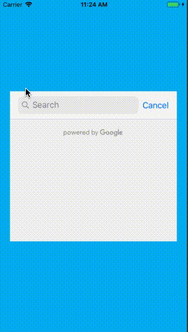

# CustomizingGooglePlacePicker
Popup google place picker instead of present by default

## The story
I have a request to make GMSAutocompleteViewController in a popup not present as default in iOS, so I make it

## This is what it looks

## Some notes
- I manually add Google SDK. Why? Because Coapod is ugly

- You need change your API before using 

## Spec
- Swift 4.2

## End
Have fun!

---
## Author

This repo was developed by [@lamha](https://github.com/HaLamUs). 
Follow or connect with me on [my LinkedIn](https://www.linkedin.com/in/lamhacs). 

